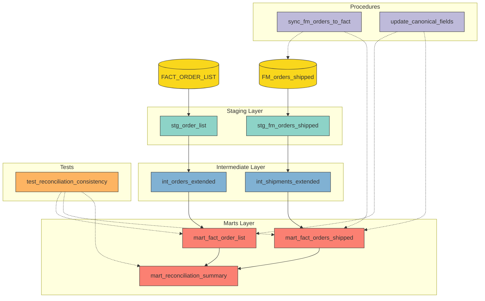

```mermaid
flowchart TD
    %% Source systems
    sourceDB1[(FACT_ORDER_LIST)]
    sourceDB2[(FM_orders_shipped)]

    %% Staging layer
    subgraph staging [Staging Layer]
        stg1[stg_order_list]
        stg2[stg_fm_orders_shipped]
    end

    %% Intermediate layer
    subgraph intermediate [Intermediate Layer]
        int1[int_orders_extended]
        int2[int_shipments_extended]
    end

    %% Marts layer
    subgraph marts [Marts Layer]
        mart1[mart_fact_order_list]
        mart2[mart_fact_orders_shipped]
        mart3[mart_reconciliation_summary]
    end

    %% Procedures
    subgraph procedures [Procedures]
        proc1[sync_fm_orders_to_fact]
        proc2[update_canonical_fields]
    end

    %% Tests
    subgraph tests [Tests]
        test1[test_reconciliation_consistency]
    end

    %% Flow connections
    sourceDB1 --> stg1
    sourceDB2 --> stg2
    stg1 --> int1
    stg2 --> int2
    int1 --> mart1
    int2 --> mart2
    mart1 --> mart3
    mart2 --> mart3
    
    %% Procedure connections
    proc1 -.-> sourceDB2
    proc1 -.-> mart2
    proc2 -.-> mart1
    proc2 -.-> mart2
    
    %% Test connections
    test1 -.-> mart1
    test1 -.-> mart2
    test1 -.-> mart3

    %% Styling
    classDef source fill:#f9d71c,stroke:#333,stroke-width:1px
    classDef stage fill:#8dd3c7,stroke:#333,stroke-width:1px
    classDef intermediate fill:#80b1d3,stroke:#333,stroke-width:1px
    classDef mart fill:#fb8072,stroke:#333,stroke-width:1px
    classDef procedure fill:#bebada,stroke:#333,stroke-width:1px
    classDef test fill:#fdb462,stroke:#333,stroke-width:1px
    
    class sourceDB1,sourceDB2 source
    class stg1,stg2 stage
    class int1,int2 intermediate
    class mart1,mart2,mart3 mart
    class proc1,proc2 procedure
    class test1 test
```
