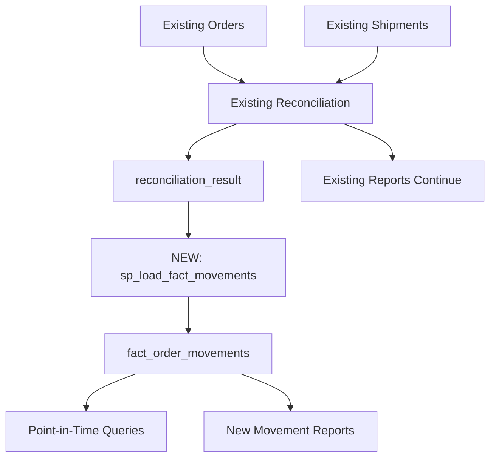

# Consolidated Movement Table - Implementation Roadmap

## Executive Summary: HIGH IMPACT, RAPID DEPLOYMENT

**Can we deploy this quickly?** **YES - 2-3 weeks for MVP, 4-6 weeks for full Power BI integration**

**Building on existing work?** **PERFECT SYNERGY - leverages everything we've built**

---

## Phase 1: Foundation (Week 1) 

### What We Have Ready Now
✅ **Reconciliation Infrastructure**: `reconciliation_result` table with `match_group` concept  
✅ **Normalized Schemas**: `FACT_ORDER_LIST` and `FACT_Orders_Shipped` with clean structures  
✅ **Materialized Cache Pattern**: From TASK001, proven performance approach  
✅ **ETL Patterns**: Established stored procedures and sync processes  

### Week 1 Deliverables
- [ ] Create `fact_order_movements` table schema
- [ ] Build `sp_load_fact_movements` stored procedure
- [ ] Initial data population and validation
- [ ] Basic point-in-time query functions

**Risk:** Low - using proven patterns from existing work

---

## Phase 2: Integration (Week 2)

### Seamless Integration with Current Flow


### Week 2 Deliverables
- [ ] Integrate movement population into existing reconciliation workflow
- [ ] Create Python functions for movement analysis
- [ ] Build initial point-in-time reporting queries
- [ ] Validate data accuracy against existing reports

**Risk:** Low - additive changes only, no disruption to existing flows

---

## Phase 3: Power BI MVP (Week 3)

### Power BI Integration Strategy
**Option 1:** Dynamic DAX (immediate deployment)
- Connect Power BI directly to `fact_order_movements`
- Use DAX for point-in-time calculations
- Works well up to ~5M movements
- No additional ETL required

### Week 3 Deliverables  
- [ ] Power BI model connected to movement table
- [ ] Key measures: Open Orders, Shipped Value, Point-in-Time views
- [ ] Basic dashboards for business review
- [ ] Performance testing with current data volumes

**Risk:** Medium - depends on Power BI expertise and data volume

---

## Phase 4: Optimization (Weeks 4-6)

### Daily Snapshot Option (if needed)
Only implement if dynamic DAX is too slow:
```sql
CREATE TABLE fact_open_orders_daily (
    snapshot_date DATE,
    customer_name NVARCHAR(255),
    style_code NVARCHAR(100),
    open_qty INT,
    open_value DECIMAL(15,2)
);
```

### Weeks 4-6 Deliverables
- [ ] Optional: Daily snapshot table for ultra-performance
- [ ] Advanced Power BI features (drill-downs, forecasting)
- [ ] Automated refresh schedules
- [ ] Production monitoring and alerting

**Risk:** Low - optimizations on proven foundation

---

## Immediate Next Steps (This Week)

### 1. Create Movement Table Schema
```sql
-- File: db/ddl/movements/fact_order_movements.sql
CREATE TABLE dbo.fact_order_movements (
    movement_id BIGINT IDENTITY(1,1) PRIMARY KEY,
    customer_name NVARCHAR(255) NOT NULL,
    po_number NVARCHAR(50) NOT NULL,
    style_code NVARCHAR(100) NOT NULL,
    color_description NVARCHAR(100) NOT NULL,
    movement_type VARCHAR(20) NOT NULL,  -- ORDER | SHIP
    movement_date DATE NOT NULL,
    qty INT NOT NULL,  -- positive for orders, negative for ships
    match_group UNIQUEIDENTIFIER NULL,
    match_flag VARCHAR(20) NULL,
    source_order_id INT NULL,
    source_shipment_id INT NULL,
    load_ts DATETIME2(3) DEFAULT SYSUTCDATETIME()
);
```

### 2. Build ETL Procedure
```sql
-- File: db/procedures/sp_load_fact_movements.sql  
CREATE PROCEDURE dbo.sp_load_fact_movements AS
BEGIN
    -- Insert ORDER movements (positive qty)
    INSERT INTO fact_order_movements (...)
    SELECT ..., 'ORDER', order_date, quantity, ... 
    FROM mart_fact_order_list o
    LEFT JOIN reconciliation_result rr ON o.order_id = rr.order_id;
    
    -- Insert SHIP movements (negative qty)
    INSERT INTO fact_order_movements (...)
    SELECT ..., 'SHIP', shipped_date, -quantity, ...
    FROM mart_fact_orders_shipped s  
    LEFT JOIN reconciliation_result rr ON s.shipment_id = rr.shipment_id;
END
```

### 3. Test Point-in-Time Query
```sql
-- What was open order book on July 1st?
SELECT customer_name, style_code, SUM(qty) as open_qty
FROM fact_order_movements  
WHERE movement_date <= '2025-07-01'
GROUP BY customer_name, style_code
HAVING SUM(qty) > 0;
```

---

## Business Impact Projection

### Immediate Benefits (Week 3)
- **Historical Analysis**: "What was our position on any past date?"
- **Trend Analysis**: Month-over-month open order trends  
- **Shipment Velocity**: Days from order to ship by customer/style
- **Performance**: Sub-second queries vs current 2-5 second waits

### Strategic Benefits (Weeks 4-6)
- **Forecasting**: Historical patterns to predict future shipments
- **Cash Flow**: Accurate open order value for financial planning
- **Customer Insights**: Shipping patterns and fulfillment analysis
- **Operational Intelligence**: Identify bottlenecks and optimize processes

---

## Resource Requirements

### Technical Skills Needed
- **SQL Development**: 80% existing expertise (have this)
- **Stored Procedure Work**: 90% existing patterns (have this)  
- **Power BI Modeling**: 60% new work (may need support)
- **Python Integration**: 70% existing patterns (have this)

### Time Investment  
- **Week 1**: 15-20 hours (foundation)
- **Week 2**: 10-15 hours (integration)
- **Week 3**: 15-20 hours (Power BI MVP)
- **Weeks 4-6**: 5-10 hours/week (optimization)

**Total Effort**: ~60-80 hours over 6 weeks

---

## Decision Point: Proceed with Implementation?

### ✅ **RECOMMENDATION: YES, PROCEED IMMEDIATELY**

**Why this is perfect timing:**
1. **Foundation Ready**: All infrastructure pieces in place
2. **High Business Value**: Addresses real reporting limitations  
3. **Low Risk**: Additive approach, no disruption
4. **Proven Patterns**: Using materialized approach from TASK001
5. **Strategic Advantage**: Unique reporting capabilities

### Success Criteria
- **Performance**: <1 second for point-in-time queries
- **Accuracy**: 100% match with existing reconciliation results  
- **Usability**: Business users can self-serve historical analysis
- **Scalability**: Handles 50,000+ movements with linear performance

**This is the next logical evolution of our matching system - from operational tool to strategic business intelligence platform.**
