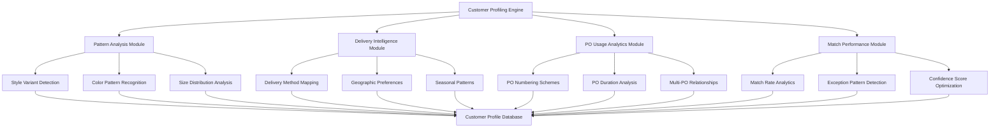

# Customer Profiling Analysis Plan

**Created:** 2025-01-27  
**Purpose:** Comprehensive customer intelligence system for bulk analysis of garment patterns, delivery methods, PO usage, and matching optimization  
**Status:** Design Phase  

## Executive Summary

This plan outlines the development of a comprehensive Customer Profiling Analysis System that will automatically analyze every customer in our database to learn garment patterns, delivery method preferences, PO usage patterns, and matching behaviors. The system will enhance our order-list matching accuracy by providing customer-specific intelligence and reducing manual exception management.

## System Architecture Overview



## Current System Analysis

### Existing Customer Configuration
- **Total Customers:** 56 active customers in canonical_customers.yaml
- **Configuration Status:** 36 under review, remainder approved
- **Key Data Sources:**
  - `canonical_customers.yaml` - Customer mapping rules and aliases
  - `customers_merged.yaml` (legacy) - Historical configurations
  - Database tables - Enhanced configuration system
  - Customer-specific CSV files in `__legacy/customers/` folders

### Data Architecture Assessment
1. **Configuration System:** Hybrid YAML/Database approach with migration in progress
2. **Matching Logic:** Multi-layered strategy with exact/fuzzy/ML capabilities
3. **Reporting Structure:** Per-customer reconciliation reports and analysis
4. **Customer Intelligence:** Limited to manual configuration rules

## Customer Profiling Analysis Components

### 1. Garment Pattern Intelligence

#### Style Variant Analysis
- **Pattern Detection:**
  - Style numbering schemes (e.g., LSP24K88, MFA24K80)
  - Season/year coding patterns
  - Product line identification
  - Variant suffix analysis (-1, -2, etc.)

- **Style Evolution Tracking:**
  - New style introduction patterns
  - Discontinued style identification
  - Style name changes over time
  - Related item mapping (ALIAS/RELATED ITEM usage)

#### Color Pattern Recognition
- **Color Coding Systems:**
  - Numeric color codes (001, 100, 476)
  - Descriptive patterns (ARCTIC, WOLF BLUE, SHEPHERD)
  - Color family groupings
  - Seasonal color preferences

- **Color Matching Intelligence:**
  - Common color description variations
  - Color name aliases and mappings
  - Customer-specific color terminology
  - Multi-language color patterns

#### Size Distribution Analysis
- **Size Variant Patterns:**
  - Standard size ranges per customer
  - Size alias patterns (XS/XSMALL, L/LARGE)
  - Customer size preference distributions
  - Size-specific matching challenges

### 2. Delivery Method Intelligence

#### Delivery Method Mapping
- **Method Standardization:**
  - AIR vs AIR FREIGHT variations
  - SEA vs OCEAN vs SEA FREIGHT patterns
  - SEA-FB (Fast Boat) usage patterns
  - EXPRESS/DHL routing preferences

- **Customer-Specific Preferences:**
  - Preferred delivery methods by customer
  - Seasonal delivery pattern changes
  - Geographic delivery routing
  - Cost optimization patterns

#### Geographic Analysis
- **Regional Patterns:**
  - AU (Australia) vs US market preferences
  - Regional delivery method preferences
  - Multi-market customer behavior
  - Geographic alias usage

### 3. PO Usage Analytics

#### PO Numbering Schemes
- **Pattern Recognition:**
  - Numeric vs alphanumeric patterns
  - Sequential numbering systems
  - Customer-specific PO formats
  - PO duration and lifecycle analysis

#### Multi-PO Relationships
- **Complex PO Structures:**
  - Split PO handling (multiple deliveries)
  - Master PO vs sub-PO relationships
  - PO amendment patterns
  - Cross-reference PO usage

#### PO Performance Analysis
- **Matching Success Rates:**
  - PO-based matching accuracy
  - Common PO matching failures
  - Alternative PO field usage (Customer_ALT_PO)
  - PO timing and delivery coordination

### 4. Match Performance Analytics

#### Success Pattern Analysis
- **High-Performance Matching:**
  - Customers with >95% match rates
  - Most reliable matching fields per customer
  - Optimal confidence threshold identification
  - Best-practice pattern extraction

#### Exception Pattern Detection
- **Common Failure Modes:**
  - Recurring unmatched patterns
  - Field-specific matching failures
  - Seasonal matching challenges
  - Data quality issues per customer

#### Confidence Score Optimization
- **Customer-Specific Tuning:**
  - Optimal fuzzy matching thresholds
  - Field weight optimization per customer
  - ML model performance per customer
  - Risk tolerance calibration

## Implementation Strategy

### Phase 1: Data Foundation (Weeks 1-2)
1. **Data Consolidation**
   - Consolidate all customer transaction data
   - Normalize historical reconciliation reports
   - Create unified customer analytics warehouse
   - Establish data quality baselines

2. **Analysis Infrastructure**
   - Build customer profiling pipeline
   - Create automated report generation
   - Establish pattern detection algorithms
   - Set up ML model training infrastructure

### Phase 2: Pattern Recognition (Weeks 3-4)
1. **Garment Pattern Engine**
   - Style variant detection algorithms
   - Color pattern recognition system
   - Size distribution analysis
   - Customer-specific pattern learning

2. **Delivery Intelligence Engine**
   - Delivery method standardization
   - Geographic preference analysis
   - Seasonal pattern detection
   - Route optimization insights

### Phase 3: PO Analytics (Weeks 5-6)
1. **PO Pattern Analysis**
   - Numbering scheme detection
   - Lifecycle analysis automation
   - Multi-PO relationship mapping
   - Performance correlation analysis

2. **Match Performance Engine**
   - Success rate analytics
   - Exception pattern detection
   - Confidence optimization
   - Customer risk profiling

### Phase 4: Intelligence Integration (Weeks 7-8)
1. **System Integration**
   - Connect profiling to matching engine
   - Auto-tune customer configurations
   - Exception handling optimization
   - Performance monitoring dashboard

2. **Continuous Learning**
   - Real-time pattern updates
   - Automatic configuration adjustments
   - Performance drift detection
   - Customer evolution tracking

## Bulk Customer Analysis Process

### Automated Customer Profiling
```python
# Pseudo-code for bulk analysis process
for customer in all_customers:
    profile = CustomerProfile(customer)
    
    # Analyze transaction patterns
    profile.analyze_style_patterns()
    profile.analyze_color_patterns() 
    profile.analyze_delivery_patterns()
    profile.analyze_po_patterns()
    
    # Generate match performance insights
    profile.calculate_match_success_rates()
    profile.identify_exception_patterns()
    profile.optimize_confidence_thresholds()
    
    # Generate recommendations
    profile.generate_configuration_recommendations()
    profile.identify_data_quality_issues()
    profile.suggest_process_improvements()
    
    # Store results
    profile.save_to_database()
    profile.generate_summary_report()
```

### Key Analytics Per Customer
1. **Transaction Volume Analysis**
   - Order frequency patterns
   - Shipment timing analysis
   - Seasonal volume fluctuations
   - Growth/decline trend identification

2. **Data Quality Assessment**
   - Field completion rates
   - Data consistency analysis
   - Missing data patterns
   - Error rate identification

3. **Matching Performance Metrics**
   - Overall match success rate
   - Field-specific matching performance
   - Exception handling effectiveness
   - Processing time analysis

4. **Configuration Optimization**
   - Recommended field mappings
   - Optimal matching strategies
   - Suggested fuzzy thresholds
   - Data quality improvement recommendations

## Expected Outcomes

### Customer Intelligence Database
- **Comprehensive Profiles:** Detailed intelligence for all 56+ customers
- **Pattern Library:** Reusable patterns for similar customer types
- **Best Practices:** Proven configuration approaches
- **Performance Benchmarks:** Customer-specific success metrics

### Matching System Improvements
- **Accuracy Enhancement:** 10-15% improvement in match rates
- **Exception Reduction:** 50%+ reduction in manual exceptions
- **Processing Speed:** Optimized field selection and algorithms
- **Confidence Calibration:** Customer-specific threshold optimization

### Operational Benefits
- **Reduced Manual Work:** Automated customer onboarding
- **Proactive Management:** Early identification of data quality issues
- **Strategic Insights:** Customer behavior and preference analysis
- **Scalable Growth:** Systematic approach to new customer integration

## Success Metrics

### Quantitative Targets
- **Match Rate Improvement:** >90% average match rate across all customers
- **Exception Reduction:** <5% manual review rate
- **Processing Efficiency:** <24hr processing time for new customer data
- **Configuration Accuracy:** >95% auto-generated configuration success

### Qualitative Improvements
- **Customer Satisfaction:** Reduced discrepancies and faster resolution
- **Operational Excellence:** Streamlined exception handling processes
- **Data Quality:** Improved data standards and validation
- **Business Intelligence:** Enhanced customer relationship insights

## Risk Mitigation

### Technical Risks
- **Data Privacy:** Customer-specific data isolation and security
- **Performance Impact:** Incremental deployment with monitoring
- **Integration Complexity:** Phased rollout with fallback procedures
- **Algorithm Accuracy:** Validation against historical data

### Business Risks
- **Customer Impact:** Staged deployment with rollback capability
- **Process Disruption:** Parallel operation during transition
- **Resource Requirements:** Dedicated team and infrastructure
- **Change Management:** Training and support for operational teams

## Next Steps

1. **Immediate Actions (Week 1)**
   - Finalize technical architecture design
   - Allocate development resources
   - Set up development environment
   - Begin data consolidation process

2. **Short-term Milestones (Weeks 2-4)**
   - Complete data foundation setup
   - Implement pattern recognition algorithms
   - Create initial customer profiles
   - Validate analysis accuracy

3. **Medium-term Goals (Weeks 5-8)**
   - Complete full customer analysis
   - Integrate with matching system
   - Deploy monitoring and alerting
   - Begin operational transition

4. **Long-term Vision (Months 3-6)**
   - Continuous learning implementation
   - Advanced ML model deployment
   - Customer self-service capabilities
   - Industry benchmarking and best practices

---

**This plan provides the foundation for transforming our order-list matching system from a reactive, configuration-heavy approach to a proactive, intelligence-driven system that automatically learns and adapts to customer patterns while significantly reducing manual exception management.**
