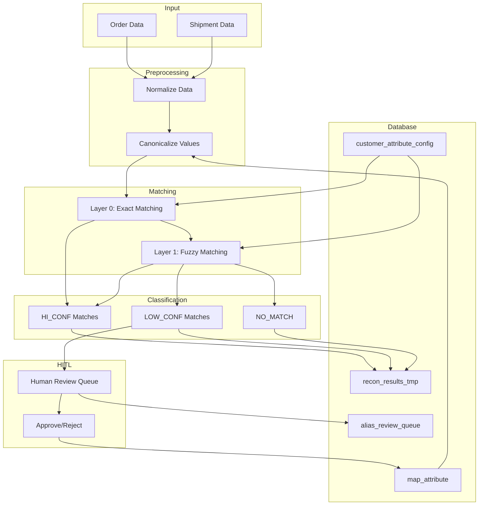
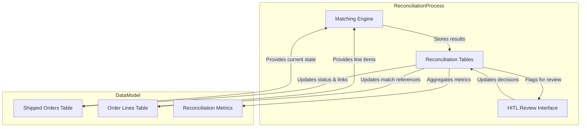

# System Patterns

## System Architecture

The Order-List Matching System follows a layered architecture with a human-in-the-loop component:

## Key Technical Decisions

1. **Database-Driven Approach**: Moving from YAML to database for configuration and mappings to enable:
   - Real-time updates via HITL
   - Centralized storage
   - Transaction support
   - Complex queries

2. **recordlinkage Library**: Selected for fuzzy matching due to:
   - Comprehensive similarity metrics
   - Configurable comparators
   - Scalable indexing

3. **Layered Matching Strategy**:
   - Layer 0 (Exact): Fast and deterministic for known patterns
   - Layer 1 (Fuzzy): Handles variations with confidence scores
   - HITL: Human review for borderline cases

4. **Style Exact Match Requirement**: Styles must match exactly or be forced to LOW_CONF regardless of overall score to prevent incorrect matches

5. **Split Shipment Detection**: Pre-process to consolidate shipments by style+color+PO before quantity comparison

## Design Patterns in Use

1. **Repository Pattern**: Data access abstracted through repository classes
2. **Factory Method**: For creating different matching strategies
3. **Strategy Pattern**: Swappable matching algorithms
4. **Observer Pattern**: For monitoring match results
5. **Command Pattern**: For HITL operations

## Component Relationships

### Data Flow
1. Orders and shipments are loaded from source systems
2. Data is normalized (date formats, capitalization, etc.)
3. Values are canonicalized using map_attribute table
4. Layer 0 attempts exact matching on canonical values
5. Unmatched records proceed to Layer 1 for fuzzy matching
6. Matches are classified by confidence level
7. LOW_CONF matches are queued for human review
8. Approved mappings are added to map_attribute table
9. Results are stored in reconciliation_result table
10. Reconciled shipments are marked in FM_orders_shipped with a reconciliation_status flag
11. Split shipments are linked using a common split_group_id

### Post-Reconciliation Data Updates
1. **Shipment Status Updates**: After reconciliation pipeline runs, the system automatically updates the data model's shipped orders tables:
   - Sets reconciliation_status to 'MATCHED' for high-confidence and approved matches
   - Sets reconciliation_status to 'UNMATCHED' for confirmed non-matches
   - Sets reconciliation_status to 'PENDING_REVIEW' for matches in HITL queue
   - Records reconciliation_date timestamp for audit trail
   - Stores reconciliation_id for linking back to detailed match information
   - Updates order_id reference to link shipment with corresponding order record
   - Updates order_line_id reference when specific size/line item is matched

2. **Exception Management Workflow**:
   - Unmatched shipments are flagged in data model with reconciliation_status = 'UNMATCHED'
   - Records requiring manual intervention are added to hitl_queue table with priority score
   - The HITL review process uses Streamlit for visualization and decision-making
   - Streamlit interface CANNOT directly edit source data tables - it can only:
     - Approve/reject suggested matches
     - Select alternative order matches from search results
     - Add mappings/aliases to be used in future matching
     - Add notes explaining decision rationale
   - All HITL decisions generate entries in reconciliation_audit_log
   - After HITL review, an automated process applies approved changes to data model tables
   - Weekly exception reports highlight patterns requiring business process improvements

3. **Split Shipment Handling**:
   - Split shipments detected based on quantity/line item distribution
   - Related shipments linked via split_group_id field in the data model
   - Primary shipment record identified with is_primary_shipment flag
   - Child shipments reference parent via parent_shipment_id
   - Each split gets appropriate portion of quantity distributed
   - HITL interface provides special split shipment view for easier validation

### Key Components
- **Core Matching Engine**: Orchestrates the matching process
- **Canonicalization Service**: Applies known mappings from database
- **HITL Interface**: Streamlit UI for human review and exception management
- **Database Layer**: Persistence for mappings, results, and reconciliation status
- **Reporting Module**: Generates reconciliation reports and exception summaries
- **Status Tracking Service**: Updates data_model tables with reconciliation status

## Data Flow Between Reconciliation and Data Model

This flow ensures that the reconciliation process maintains the integrity of the data model while providing the necessary feedback loops for continuous improvement.
